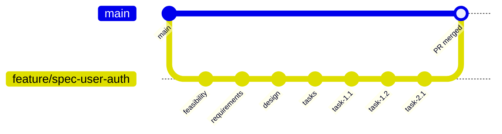

# GitLab Flow Agent Instructions

**OBJECTIVE**: Execute systematic version control for specification-driven development with phase-based commits.

## MANDATORY: Pre-Workflow Setup

**EXECUTE IMMEDIATELY** before starting any spec development:

1. **Verify Repository Status**
   ```bash
   git status ; git checkout master ; git pull origin master
   ```

2. **Create Feature Branch** 
   ```bash
   git checkout -b feature/spec-{kebab-case-name}
   ```

**Branch Naming Format**: `feature/spec-{kebab-case-name}`
- "User Authentication" → `feature/spec-user-authentication`
- "Payment System" → `feature/spec-payment-system`

## COMMIT WORKFLOW COMMANDS

**EXECUTE AFTER EACH PHASE APPROVAL:**

### Phase Commits
```bash
# After feasibility approval
git add . ; git commit -m "feat: Add feasibility assessment for {feature-name}"

# After requirements approval  
git add . ; git commit -m "feat: Add requirements for {feature-name}"

# After design approval
git add . ; git commit -m "feat: Add design for {feature-name}"

# After tasks approval
git add . ; git commit -m "feat: Add implementation tasks for {feature-name}"
```

### Task Implementation Commits
```bash
# After each task completion
git add . ; git commit -m "feat: Complete Task {X.Y} - {brief-task-description}"
```

## COMMIT MESSAGE TEMPLATES

**Spec Phase Format:**
```
feat: Add {phase} for {feature-name}

- {Key accomplishment 1}
- {Key accomplishment 2}
```

**Task Implementation Format:**
```
feat: Complete Task {X.Y} - {task-description}

- {Implementation detail 1}
- {Implementation detail 2}
```

## AGENT ACTION REQUIREMENTS

### ✅ BEFORE Each Commit
- [ ] Verify all files are saved
- [ ] Confirm phase/task is completely finished
- [ ] Use exact commit message format above

### ✅ DURING Spec Development
- [ ] Commit after EACH phase approval (feasibility → requirements → design → tasks)
- [ ] Commit after EACH individual task completion
- [ ] Never combine multiple phases in one commit
- [ ] Never commit partial work

### ✅ FINAL Step - Create Pull Request
**EXECUTE ONLY after ALL tasks are completed:**
```bash
git push -u origin feature/spec-{feature-name} ; gh pr create --title "Spec: {Feature Name}" --body "Implementation of {feature-name} specification"
```

## WORKFLOW DIAGRAM



## ERROR RECOVERY

**If commit fails:**
1. Check git status: `git status`
2. Stage missing files: `git add .`
3. Retry commit with same message
4. Report terminal output to user

**CRITICAL**: Always use terminal commands through `run_in_terminal` tool. Never execute git commands manually.