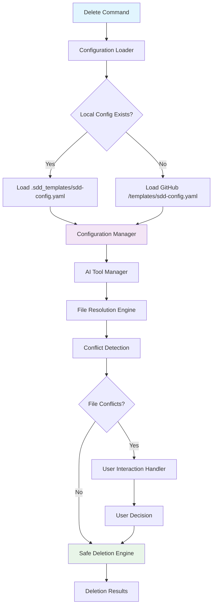
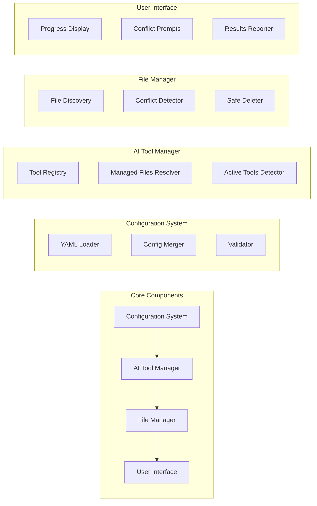

# Manual File Preservation Design Document

## Overview

This design document outlines the technical implementation for precise file deletion by defining exactly which files each AI tool creates, ensuring manual files are never accidentally deleted during CLI cleanup operations.

**Current Implementation Status**: NOT IMPLEMENTED - The design provides a complete blueprint for implementing AI tool specific file management with YAML configuration support.

## Architecture

### High-Level Architecture



### Component Architecture



## Components and Interfaces

### 1. Configuration System

#### ConfigurationLoader
```python
from abc import ABC, abstractmethod
from typing import Dict, Any, Optional
from pathlib import Path

class ConfigurationLoader(ABC):
    """Abstract base class for configuration loading"""
    
    @abstractmethod
    def load_config(self) -> Dict[str, Any]:
        """Load configuration from source"""
        pass
    
    @abstractmethod
    def is_available(self) -> bool:
        """Check if configuration source is available"""
        pass

class LocalConfigLoader(ConfigurationLoader):
    """Loads configuration from local .sdd_templates directory"""
    
    def __init__(self, project_root: Path):
        self.config_path = project_root / ".sdd_templates" / "sdd-config.yaml"
    
    def load_config(self) -> Dict[str, Any]:
        if not self.is_available():
            return {}
        
        import yaml
        return yaml.safe_load(self.config_path.read_text())
    
    def is_available(self) -> bool:
        return self.config_path.exists()

class RemoteConfigLoader(ConfigurationLoader):
    """Loads configuration from GitHub templates"""
    
    def __init__(self, github_downloader):
        self.github_downloader = github_downloader
        self.config_path = "templates/sdd-config.yaml"
    
    def load_config(self) -> Dict[str, Any]:
        if not self.is_available():
            return {}
        
        import yaml
        content = self.github_downloader.download_file(self.config_path)
        return yaml.safe_load(content)
    
    def is_available(self) -> bool:
        return self.github_downloader.file_exists(self.config_path)
```

## Data Models

### Configuration Schema

```python
from typing import Dict, List, Optional
from pydantic import BaseModel, Field

class ManagedFiles(BaseModel):
    """Managed files configuration for an AI tool"""
    chatmodes: List[str] = Field(default_factory=list)
    instructions: List[str] = Field(default_factory=list) 
    prompts: List[str] = Field(default_factory=list)
    commands: List[str] = Field(default_factory=list)

class AIToolConfig(BaseModel):
    """AI tool configuration"""
    name: str
    description: str = ""
    template_dir: str
    managed_files: ManagedFiles = Field(default_factory=ManagedFiles)

class DeleteBehaviorConfig(BaseModel):
    """Delete command behavior configuration"""
    confirm_before_delete: bool = True
    show_file_preview: bool = True
    group_by_ai_tool: bool = True

class CLIConfig(BaseModel):
    """CLI behavior configuration"""
    delete_behavior: DeleteBehaviorConfig = Field(default_factory=DeleteBehaviorConfig)

class PreferencesConfig(BaseModel):
    """User preferences configuration"""
    default_ai_tools: List[str] = Field(default=["github-copilot"])
    template_source: str = "github"

class SDDConfig(BaseModel):
    """Root configuration schema"""
    version: str = "1.0"
    ai_tools: Dict[str, AIToolConfig] = Field(default_factory=dict)
    cli: CLIConfig = Field(default_factory=CLIConfig)
    preferences: PreferencesConfig = Field(default_factory=PreferencesConfig)
```

## API Contract

### Delete Command Interface

```python
from typing import List, Optional
from dataclasses import dataclass
from pathlib import Path

@dataclass
class DeleteResult:
    """Result of delete operation"""
    deleted_files: List[Path]
    skipped_files: List[Path]
    failed_deletions: List[Path]
    total_conflicts: int
    
    @property
    def success_count(self) -> int:
        return len(self.deleted_files)
    
    @property
    def skip_count(self) -> int:
        return len(self.skipped_files)
    
    @property
    def failure_count(self) -> int:
        return len(self.failed_deletions)
```

## Error Handling

### Configuration Errors
```python
class ConfigurationError(Exception):
    """Base class for configuration errors"""
    pass

class InvalidYAMLError(ConfigurationError):
    """Invalid YAML syntax in configuration file"""
    pass

class MissingConfigError(ConfigurationError):
    """Required configuration is missing"""
    pass
```

## Performance Considerations

### Expected Performance Targets
- Configuration loading: < 500ms (including network)
- File discovery: < 100ms for typical projects
- User interaction: No performance requirements (user-paced)

## Security Considerations

### Configuration Security
- **Input Validation**: All YAML input validated against schema
- **Path Sanitization**: File paths sanitized to prevent directory traversal
- **Safe Defaults**: Secure defaults when configuration is missing

### File Operation Security  
- **Permission Checks**: Verify write permissions before deletion
- **Path Validation**: Ensure operations stay within project boundaries

## Testing Strategy

### Unit Tests
- Configuration loading and merging logic
- AI tool management functions
- File discovery and conflict detection
- User interaction logic

### Integration Tests
- End-to-end delete command execution
- Configuration system integration
- GitHub API integration
- File system operations

## Missing Components

Currently missing from implementation:
1. **Active AI Tool Detection**: Logic to determine which AI tools user has selected
2. **Configuration Persistence**: Saving user preferences between sessions
3. **Template Integration**: Full integration with existing template download system
4. **Configuration Validation**: Schema validation for YAML files

## Future Development Phases

### Phase 1 (Current): Core Implementation
- Basic configuration system
- File conflict detection
- User interaction for conflicts

### Phase 2: Enhanced Features  
- Active tool detection
- Configuration validation
- Performance optimizations

### Phase 3: Advanced Features
- Template integration
- Advanced user preferences
- Enhanced error handling