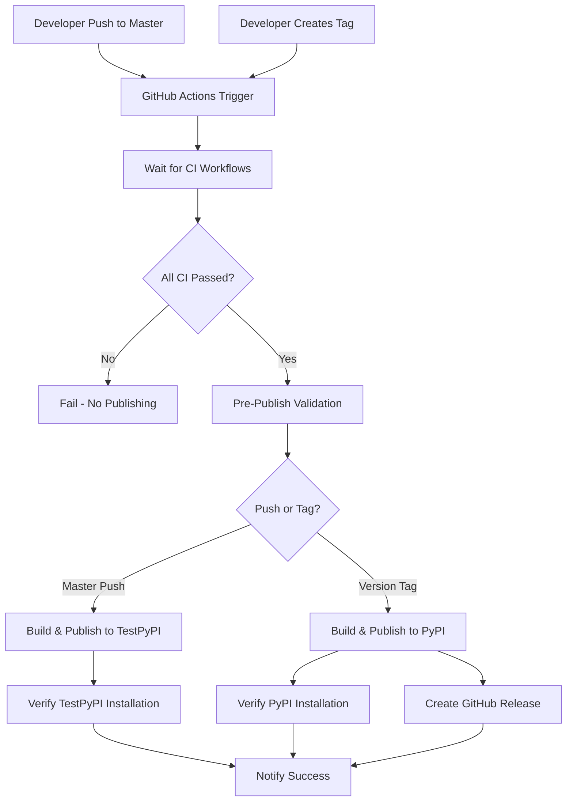
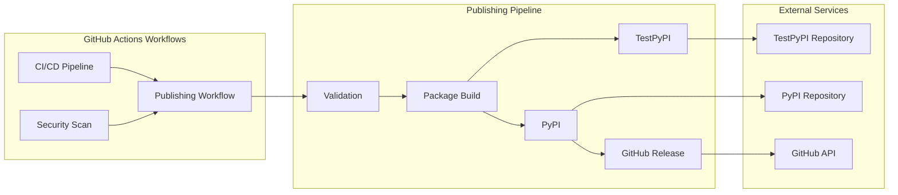

# Design Document: PyPI Publishing Automation

**Status**: IN_PROGRESS  
**Designer**: AI Assistant  
**Date**: 2025-09-14  
**Version**: 1.0  

## Architecture Overview

### **High-Level Architecture**



### **Component Architecture**



## Detailed Design

### **1. GitHub Actions Workflow Design**

#### **File Structure**
```
.github/
├── workflows/
│   ├── ci.yml                 # Existing CI pipeline
│   ├── security.yml           # Existing security checks
│   └── publish.yml            # New publishing workflow
├── environments/
│   ├── testpypi.yml          # TestPyPI environment config
│   └── pypi.yml              # PyPI environment config
└── scripts/
    └── verify_installation.py # Installation verification script
```

#### **Publishing Workflow Design**

**File**: `.github/workflows/publish.yml`

```yaml
name: Publish to PyPI

on:
  push:
    branches: [master]
  push:
    tags: ['v*']
  workflow_dispatch:

jobs:
  wait-for-ci:
    name: Wait for CI Completion
    runs-on: ubuntu-latest
    steps:
      - name: Wait for CI workflow
        uses: lewagon/wait-on-check-action@v1.3.1
        with:
          ref: ${{ github.ref }}
          check-name: 'Test Suite'
          repo-token: ${{ secrets.GITHUB_TOKEN }}
          wait-interval: 10
      
      - name: Wait for Security workflow
        uses: lewagon/wait-on-check-action@v1.3.1
        with:
          ref: ${{ github.ref }}
          check-name: 'Security Scan'
          repo-token: ${{ secrets.GITHUB_TOKEN }}
          wait-interval: 10

  pre-publish-validation:
    name: Pre-Publish Validation
    runs-on: ubuntu-latest
    needs: [wait-for-ci]
    outputs:
      should-publish: ${{ steps.validation.outputs.result }}
    steps:
      - name: Checkout
        uses: actions/checkout@v4
      
      - name: Setup Python
        uses: actions/setup-python@v5
        with:
          python-version: '3.11'
      
      - name: Install dependencies
        run: |
          python -m pip install --upgrade pip
          pip install -e .
          pip install pytest build twine
      
      - name: Run critical tests
        run: |
          python -m pytest tests/unit/test_commands/ -v --tb=short
      
      - name: Verify CLI functionality
        run: |
          improved-sdd --help
          improved-sdd --version
      
      - name: Build package
        run: python -m build
      
      - name: Validate package
        id: validation
        run: |
          python -m twine check dist/*
          echo "result=success" >> $GITHUB_OUTPUT

  publish-testpypi:
    name: Publish to TestPyPI
    runs-on: ubuntu-latest
    needs: [pre-publish-validation]
    if: github.ref == 'refs/heads/master' && needs.pre-publish-validation.outputs.should-publish == 'success'
    environment:
      name: testpypi
      url: https://test.pypi.org/p/improved-sdd
    steps:
      - name: Checkout
        uses: actions/checkout@v4
      
      - name: Setup Python
        uses: actions/setup-python@v5
        with:
          python-version: '3.11'
      
      - name: Build package
        run: |
          python -m pip install --upgrade pip build twine
          python -m build
      
      - name: Publish to TestPyPI
        env:
          TWINE_USERNAME: __token__
          TWINE_PASSWORD: ${{ secrets.TEST_PYPI_API_TOKEN }}
        run: |
          python -m twine upload --repository testpypi dist/* --skip-existing
      
      - name: Verify installation
        run: |
          sleep 60
          pip install --index-url https://test.pypi.org/simple/ --extra-index-url https://pypi.org/simple/ improved-sdd
          improved-sdd --help

  publish-pypi:
    name: Publish to PyPI
    runs-on: ubuntu-latest
    needs: [pre-publish-validation]
    if: startsWith(github.ref, 'refs/tags/v') && needs.pre-publish-validation.outputs.should-publish == 'success'
    environment:
      name: pypi
      url: https://pypi.org/p/improved-sdd
    permissions:
      id-token: write
      contents: write
    steps:
      - name: Checkout
        uses: actions/checkout@v4
      
      - name: Setup Python
        uses: actions/setup-python@v5
        with:
          python-version: '3.11'
      
      - name: Build package
        run: |
          python -m pip install --upgrade pip build twine
          python -m build
      
      - name: Publish to PyPI
        env:
          TWINE_USERNAME: __token__
          TWINE_PASSWORD: ${{ secrets.PYPI_API_TOKEN }}
        run: |
          python -m twine upload dist/*
      
      - name: Verify installation
        run: |
          sleep 30
          pip install improved-sdd
          improved-sdd --help
      
      - name: Create GitHub Release
        uses: actions/create-release@v1
        env:
          GITHUB_TOKEN: ${{ secrets.GITHUB_TOKEN }}
        with:
          tag_name: ${{ github.ref }}
          release_name: Release ${{ github.ref }}
          body: |
            🚀 **New Release**: ${{ github.ref }}
            
            📦 **PyPI Package**: https://pypi.org/project/improved-sdd/
            
            ### Installation
            ```bash
            pip install improved-sdd
            uvx improved-sdd init
            ```
            
            ### What's New
            - All CI/CD checks passed ✅
            - Security scans clean ✅
            - Multi-platform tested ✅
            
            See [CHANGELOG.md](CHANGELOG.md) for details.
          draft: false
          prerelease: false
```

### **2. Version Management Utility Design**

#### **File**: `tools/bump_version.py`

```python
#!/usr/bin/env python3
# /// script
# requires-python = ">=3.11"
# dependencies = ["typer", "rich"]
# ///

import re
import sys
from pathlib import Path
from typing import Literal

import typer
from rich.console import Console
from rich.panel import Panel

console = Console()
app = typer.Typer(help="Manage package versioning for improved-sdd")

def get_current_version() -> str:
    """Get current version from pyproject.toml."""
    pyproject_path = Path("pyproject.toml")
    if not pyproject_path.exists():
        console.print("[red]Error: pyproject.toml not found[/red]")
        sys.exit(1)
    
    content = pyproject_path.read_text()
    match = re.search(r'version = "([^"]+)"', content)
    if not match:
        console.print("[red]Error: Could not find version in pyproject.toml[/red]")
        sys.exit(1)
    return match.group(1)

def update_version(new_version: str) -> None:
    """Update version in pyproject.toml."""
    pyproject_path = Path("pyproject.toml")
    content = pyproject_path.read_text()
    updated_content = re.sub(
        r'version = "[^"]+"',
        f'version = "{new_version}"',
        content
    )
    pyproject_path.write_text(updated_content)
    console.print(f"[green]✓ Updated version to {new_version}[/green]")

@app.command()
def current():
    """Show current version."""
    version = get_current_version()
    console.print(f"Current version: [bold cyan]{version}[/bold cyan]")

@app.command()
def bump(
    part: Literal["major", "minor", "patch"] = typer.Argument(help="Version part to bump"),
    dry_run: bool = typer.Option(False, "--dry-run", help="Show what would happen")
):
    """Bump version part (major.minor.patch)."""
    current_version = get_current_version()
    major, minor, patch = map(int, current_version.split('.'))
    
    if part == "major":
        major += 1
        minor = 0
        patch = 0
    elif part == "minor":
        minor += 1
        patch = 0
    elif part == "patch":
        patch += 1
    
    new_version = f"{major}.{minor}.{patch}"
    
    if dry_run:
        console.print(f"Would update: {current_version} → [bold green]{new_version}[/bold green]")
    else:
        update_version(new_version)
        console.print(Panel(
            f"[green]Version bumped successfully![/green]\n\n"
            f"Old: {current_version}\n"
            f"New: [bold]{new_version}[/bold]\n\n"
            f"Next steps:\n"
            f"1. git add pyproject.toml\n"
            f"2. git commit -m 'Bump version to {new_version}'\n"
            f"3. git tag v{new_version}\n"
            f"4. git push origin master --tags",
            title="🚀 Release Ready",
            border_style="green"
        ))

if __name__ == "__main__":
    app()
```

### **3. Environment Configuration Design**

#### **GitHub Environments**

**TestPyPI Environment** (`testpypi`):
- Protection Rules: None (automatic deployment)
- Secrets: `TEST_PYPI_API_TOKEN`
- URL: `https://test.pypi.org/p/improved-sdd`

**PyPI Environment** (`pypi`):
- Protection Rules: None (but could add reviewers for extra safety)
- Secrets: `PYPI_API_TOKEN`
- URL: `https://pypi.org/p/improved-sdd`
- Deployment branches: Only tags starting with `v`

### **4. Security Design**

#### **Token Management**
```yaml
# Repository Secrets
TEST_PYPI_API_TOKEN: pypi-...  # TestPyPI API token
PYPI_API_TOKEN: pypi-...       # PyPI API token
GITHUB_TOKEN: ghp_...          # Automatic GitHub token
```

#### **Security Principles**
- **Principle of Least Privilege**: Tokens have minimal required permissions
- **Environment Isolation**: Separate tokens for TestPyPI and PyPI
- **No Credential Exposure**: No tokens in logs or artifacts
- **Audit Trail**: All publishing actions logged and traceable

### **5. Error Handling Design**

#### **Error Scenarios and Responses**

| Error Type | Detection | Response | Recovery |
|------------|-----------|----------|----------|
| CI Failure | Workflow dependency check | Stop publishing pipeline | Manual investigation |
| Build Failure | Package build step | Fail with detailed error | Fix code, retry |
| Token Invalid | Upload authentication | Fail with auth error | Update token, retry |
| Version Conflict | PyPI upload | Skip with warning | Update version, retry |
| Network Timeout | Repository communication | Retry with backoff | Manual retry option |
| Installation Failure | Post-publish verification | Warning but continue | Monitor and investigate |

#### **Rollback Procedures**
1. **PyPI Package Issues**: Create new version with fixes
2. **GitHub Release Issues**: Edit or delete release manually
3. **Workflow Issues**: Revert workflow changes via pull request
4. **Token Compromise**: Rotate tokens immediately in secrets

### **6. Testing Strategy**

#### **Workflow Testing**
```yaml
# Testing approach for workflow development
1. Branch Testing:
   - Create test branch with workflow changes
   - Use workflow_dispatch for manual testing
   - Test with dry-run mode

2. TestPyPI Validation:
   - Every master push tests the full pipeline
   - Installation verification included
   - No risk to production PyPI

3. PyPI Testing:
   - Use pre-release versions (v1.0.0-alpha.1)
   - Test with dedicated test packages
   - Full end-to-end validation
```

#### **Integration Testing**
- Test CI workflow dependencies
- Verify token authentication
- Validate package building and uploading
- Test installation from both repositories

## Implementation Plan

### **Phase 1: Basic Workflow (1-2 days)**
1. Create `.github/workflows/publish.yml`
2. Set up GitHub environments
3. Configure repository secrets
4. Test basic TestPyPI publishing

### **Phase 2: Safety Integration (2-3 days)**
1. Add CI workflow dependencies
2. Implement pre-publish validation
3. Add installation verification
4. Test PyPI publishing with tags

### **Phase 3: Release Automation (1 day)**
1. Create version management utility
2. Implement GitHub release automation
3. Add comprehensive error handling
4. Update documentation

### **Phase 4: Testing and Refinement (1 day)**
1. End-to-end testing
2. Error scenario testing
3. Performance optimization
4. Documentation completion

## Monitoring and Maintenance

### **Monitoring**
- GitHub Actions workflow run history
- PyPI download statistics
- Error rate tracking
- Performance metrics

### **Maintenance Tasks**
- Regular token rotation
- Workflow dependency updates
- Python version compatibility
- Security patch applications

## Risk Mitigation

### **Technical Risks**
1. **CI Dependency Failures**: Comprehensive dependency checking
2. **Token Security**: Regular rotation and monitoring
3. **Version Conflicts**: Validation and skip-existing options
4. **Network Issues**: Retry logic and timeout handling

### **Operational Risks**
1. **Workflow Maintenance**: Version control and testing
2. **Documentation Drift**: Automated documentation updates
3. **Team Knowledge**: Comprehensive documentation and training
4. **Service Dependencies**: Fallback procedures and alternatives

## Success Metrics

### **Performance Metrics**
- Workflow execution time: Target < 15 minutes
- Success rate: Target > 99%
- Error resolution time: Target < 1 hour

### **Quality Metrics**
- Zero broken packages published
- 100% installation verification success
- Complete audit trail for all releases

### **User Experience Metrics**
- Developer satisfaction surveys
- Release frequency improvement
- Time saved from automation

This design provides a comprehensive, secure, and maintainable solution for automated PyPI publishing that follows industry best practices and ensures high-quality package distribution.