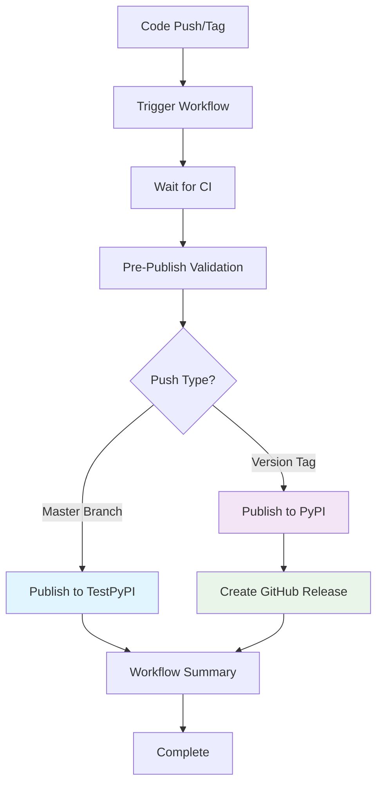

# PyPI Publishing Automation - Usage Guide

**Version**: 1.0  
**Last Updated**: September 14, 2025  
**Status**: Production Ready  

## 📋 Overview

This guide provides comprehensive instructions for using the automated PyPI publishing system for the `improved-sdd` project. The system automatically publishes packages to TestPyPI and PyPI based on repository activity, with comprehensive safety checks and quality assurance.

## 🏗️ System Architecture

### Publishing Workflow Overview



### Workflow Triggers

| Trigger | Action | Result |
|---------|--------|--------|
| **Push to Master** | Automatic TestPyPI publishing | Package available for testing |
| **Version Tag (v*.*.*)** | Automatic PyPI publishing | Public release with GitHub release |
| **Manual Dispatch** | Controlled testing/publishing | Flexible deployment options |

## 🚀 Quick Start Guide

### For Developers - Standard Release Process

1. **Development and Testing**
   ```bash
   # Work on your feature branch
   git checkout feature/my-feature
   # ... make changes and commit
   git push origin feature/my-feature
   ```

2. **Merge to Master** (TestPyPI Publishing)
   ```bash
   # Create PR and merge to master
   # This automatically triggers TestPyPI publishing
   ```

3. **Create Release** (PyPI Publishing)
   ```bash
   # Update version and create tag
   python tools/bump_version.py bump patch  # or minor/major
   git tag v1.2.3
   git push origin v1.2.3
   # This automatically triggers PyPI publishing + GitHub release
   ```

### For Maintainers - Advanced Usage

**Manual Testing**:
```bash
# Test workflow without publishing
gh workflow run publish.yml --field dry_run=true

# Manual TestPyPI publish
gh workflow run publish.yml --field target_env=testpypi
```

## 📖 Detailed Usage Instructions

### 1. Version Management

#### Using the Version Management Tool

The `tools/bump_version.py` script provides automated version management:

```bash
# Show current version
python tools/bump_version.py current

# Bump version (creates new version, doesn't tag)
python tools/bump_version.py bump patch    # 1.0.0 → 1.0.1
python tools/bump_version.py bump minor    # 1.0.0 → 1.1.0  
python tools/bump_version.py bump major    # 1.0.0 → 2.0.0

# Preview changes without applying
python tools/bump_version.py bump patch --dry-run
```

#### Complete Release Process

```bash
# 1. Ensure master is up to date
git checkout master
git pull origin master

# 2. Bump version
python tools/bump_version.py bump patch

# 3. Create and push tag
git tag v$(python tools/bump_version.py current)
git push origin v$(python tools/bump_version.py current)

# 4. Monitor workflow
gh run list --workflow=publish.yml --limit=1
```

### 2. Publishing Workflows

#### TestPyPI Publishing (Development)

**Trigger**: Any push to `master` branch  
**Purpose**: Testing and validation  
**Result**: Package available at https://test.pypi.org/project/improved-sdd/

**Process**:
1. Code merged to master
2. CI workflows complete (tests, security checks)
3. Package built and validated
4. Published to TestPyPI
5. Installation verification performed

**Testing Published Package**:
```bash
# Install from TestPyPI for testing
pip install --index-url https://test.pypi.org/simple/ improved-sdd

# Test functionality
improved-sdd --version
improved-sdd --help
```

#### PyPI Publishing (Production)

**Trigger**: Git tag matching `v*.*.*` pattern  
**Purpose**: Official releases  
**Result**: Package available at https://pypi.org/project/improved-sdd/

**Process**:
1. Version tag pushed to repository
2. CI workflows complete (tests, security checks)
3. Package built and validated
4. Published to PyPI
5. GitHub release created automatically
6. Installation verification performed

**Verifying Release**:
```bash
# Install latest release
pip install improved-sdd

# Check version matches tag
improved-sdd --version
```

### 3. Manual Workflow Control

#### Manual Dispatch Options

Access via GitHub repository → Actions → "Publish to PyPI" → "Run workflow"

**Parameters**:
- **dry_run**: `true` - Build and validate only, no publishing
- **target_env**: `testpypi` or `pypi` - Choose destination

**Use Cases**:
```bash
# Test workflow changes (dry run)
gh workflow run publish.yml --field dry_run=true

# Emergency TestPyPI publish
gh workflow run publish.yml --field target_env=testpypi

# Emergency PyPI publish (use with caution)
gh workflow run publish.yml --field target_env=pypi
```

#### Monitoring Workflow Execution

```bash
# List recent workflow runs
gh run list --workflow=publish.yml --limit=5

# View specific run details
gh run view [run-id]

# Watch live workflow execution
gh run watch [run-id]

# View workflow logs
gh run view [run-id] --log
```

## 🔧 Configuration and Setup

### Initial Repository Setup

For adding this system to a new repository:

1. **Copy Workflow Files**:
   ```bash
   # Copy workflow file
   cp .github/workflows/publish.yml [target-repo]/.github/workflows/

   # Copy supporting tools
   cp tools/bump_version.py [target-repo]/tools/
   cp tools/verify-setup.py [target-repo]/tools/
   ```

2. **Configure Repository**:
   - Follow [PyPI Setup Guide](pypi-setup-guide.md)
   - Run verification: `python tools/verify-setup.py verify`

3. **Update Project Configuration**:
   ```toml
   # pyproject.toml - Ensure proper metadata
   [build-system]
   requires = ["hatchling"]
   build-backend = "hatchling.build"

   [project]
   name = "your-package-name"
   version = "0.1.0"
   description = "Your package description"
   # ... other metadata
   ```

### Integration with Existing CI/CD

The publishing workflow integrates with existing CI by waiting for:
- **Test Suite** workflow to complete
- **Security Audit** workflow to complete

**Requirements**:
- CI workflows must be named exactly: `Test Suite`, `Security Audit`
- Workflows must use standard success/failure status
- Publishing workflow automatically waits for completion

## 🛠️ Troubleshooting Guide

### Common Issues and Solutions

#### 1. Publishing Workflow Failures

**Issue**: `Invalid API token`
```yaml
Error: HTTPError: 403 Forbidden from https://upload.pypi.org/legacy/
```

**Solutions**:
1. **Check Token Validity**:
   ```bash
   # Verify tokens in GitHub Secrets
   # Repository → Settings → Secrets and variables → Actions
   ```
2. **Regenerate Tokens**:
   - Go to PyPI/TestPyPI → Account Settings → API tokens
   - Create new token, update GitHub secrets
3. **Check Token Scope**: Ensure token has upload permissions

**Issue**: `Package already exists`
```yaml
Error: HTTPError: 400 Bad Request from https://upload.pypi.org/legacy/
```

**Solutions**:
1. **Version Conflict**: Update version number
   ```bash
   python tools/bump_version.py bump patch
   git tag v$(python tools/bump_version.py current)
   git push origin v$(python tools/bump_version.py current)
   ```
2. **Check Existing Versions**: Verify on PyPI website

#### 2. CI Workflow Dependencies

**Issue**: Publishing blocked by failed CI
```yaml
The wait-for-ci job failed because required workflows didn't pass
```

**Solutions**:
1. **Fix CI Issues First**:
   ```bash
   # Check CI status
   gh run list --workflow=ci.yml --limit=3
   gh run list --workflow=security.yml --limit=3
   
   # View failed run details
   gh run view [failed-run-id] --log
   ```

2. **Emergency Override** (Use sparingly):
   ```bash
   # Manual dispatch with dry_run first
   gh workflow run publish.yml --field dry_run=true
   
   # If dry run passes, manual publish
   gh workflow run publish.yml --field target_env=testpypi
   ```

#### 3. Package Build Issues

**Issue**: Package build fails
```yaml
Error: Building package failed
```

**Solutions**:
1. **Local Build Test**:
   ```bash
   # Test build locally
   python -m build
   python -m twine check dist/*
   ```

2. **Common Build Issues**:
   - Missing dependencies in `pyproject.toml`
   - Invalid package structure
   - File permission issues

#### 4. Environment Configuration

**Issue**: Environment not found
```yaml
Error: Environment 'testpypi' not found
```

**Solutions**:
1. **Create Missing Environments**:
   - Repository → Settings → Environments
   - Create `testpypi` and `pypi` environments
   - Follow [Setup Guide](pypi-setup-guide.md)

2. **Verify Environment Names**: Must match exactly `testpypi` and `pypi`

#### 5. Version Tag Issues

**Issue**: Tags not triggering PyPI publishing
```yaml
Workflow didn't trigger on tag push
```

**Solutions**:
1. **Check Tag Format**: Must match `v*.*.*` pattern
   ```bash
   # Correct format
   git tag v1.2.3
   
   # Incorrect format
   git tag 1.2.3          # Missing 'v' prefix
   git tag version-1.2.3  # Wrong format
   ```

2. **Push Tags**: Ensure tags are pushed to remote
   ```bash
   git push origin v1.2.3
   ```

### Debug Commands

**Workflow Debugging**:
```bash
# Check workflow file syntax
gh workflow view publish.yml

# List all workflows
gh workflow list

# Check repository configuration
gh repo view --json environments,secrets

# View environment details
gh api repos/:owner/:repo/environments
```

**Local Testing**:
```bash
# Verify setup
python tools/verify-setup.py verify

# Test package building
python -m build
python -m twine check dist/*

# Test installation locally
pip install dist/*.whl
```

## 📊 Monitoring and Maintenance

### Monitoring Guidelines

#### Workflow Health Monitoring

**Daily Checks**:
- Review failed workflow runs
- Monitor publishing success rates
- Check for authentication issues

**Commands**:
```bash
# Check recent workflow status
gh run list --workflow=publish.yml --limit=10 --json status,conclusion

# Monitor failure patterns
gh run list --workflow=publish.yml --status=failure --limit=5
```

#### Package Health Monitoring

**Weekly Checks**:
- Verify packages install correctly
- Check download statistics on PyPI
- Review user feedback and issues

**Commands**:
```bash
# Test package installation
pip install --force-reinstall improved-sdd
improved-sdd --version

# Check PyPI package page
open https://pypi.org/project/improved-sdd/
```

### Maintenance Procedures

#### Monthly Maintenance

1. **Token Rotation** (Quarterly):
   ```bash
   # 1. Generate new tokens on PyPI/TestPyPI
   # 2. Update GitHub repository secrets
   # 3. Test workflow with new tokens
   # 4. Revoke old tokens
   ```

2. **Security Review**:
   - Review access permissions
   - Check workflow logs for anomalies
   - Update security documentation

3. **Performance Review**:
   - Analyze workflow execution times
   - Optimize slow steps
   - Update resource allocations

#### Quarterly Maintenance

1. **Dependency Updates**:
   ```bash
   # Update workflow action versions
   # Update Python dependencies
   # Test compatibility
   ```

2. **Documentation Updates**:
   - Update setup guides
   - Refresh troubleshooting information
   - Review and update examples

3. **Security Audit**:
   - Complete security checklist
   - Review token permissions
   - Test incident response procedures

### Performance Metrics

**Target Metrics**:
- Workflow execution time: < 15 minutes
- Success rate: > 99%
- Time to publish: < 5 minutes after CI completion

**Monitoring Commands**:
```bash
# Analyze workflow performance
gh run list --workflow=publish.yml --json createdAt,updatedAt,conclusion --limit=20

# Check execution times
gh run view [run-id] --json timing
```

## 📚 Developer Reference

### Quick Reference Commands

**Version Management**:
```bash
# Check current version
python tools/bump_version.py current

# Bump version and create release
python tools/bump_version.py bump patch
git tag v$(python tools/bump_version.py current)
git push origin v$(python tools/bump_version.py current)
```

**Workflow Control**:
```bash
# Manual dry run test
gh workflow run publish.yml --field dry_run=true

# Emergency TestPyPI publish
gh workflow run publish.yml --field target_env=testpypi

# Monitor workflow
gh run watch $(gh run list --workflow=publish.yml --limit=1 --json databaseId --jq '.[0].databaseId')
```

**Troubleshooting**:
```bash
# Verify setup
python tools/verify-setup.py verify

# Check CI status
gh run list --workflow=ci.yml --limit=1
gh run list --workflow=security.yml --limit=1

# Test local build
python -m build && python -m twine check dist/*
```

### Workflow Integration Patterns

**Branch Protection Rules**:
```yaml
# Recommended branch protection for master
required_status_checks:
  strict: true
  contexts:
    - "Test Suite"
    - "Security Audit"
enforce_admins: true
required_pull_request_reviews:
  required_approving_review_count: 1
```

**Release Process Integration**:
```bash
# Automated release process
#!/bin/bash
set -e

# 1. Ensure clean master
git checkout master
git pull origin master

# 2. Run tests locally
python -m pytest

# 3. Bump version
python tools/bump_version.py bump ${1:-patch}
NEW_VERSION=$(python tools/bump_version.py current)

# 4. Create and push tag
git tag v$NEW_VERSION
git push origin v$NEW_VERSION

# 5. Monitor release
echo "Monitoring release workflow..."
gh run watch $(gh run list --workflow=publish.yml --limit=1 --json databaseId --jq '.[0].databaseId')
```

## 🔗 Related Documentation

- **[PyPI Setup Guide](pypi-setup-guide.md)** - Complete setup instructions
- **[Security Checklist](security-checklist.md)** - Security procedures and compliance
- **[Workflow File](.github/workflows/publish.yml)** - Technical implementation
- **[Project Requirements](.specs/pypi-publishing-automation/requirements.md)** - System requirements
- **[System Design](.specs/pypi-publishing-automation/design.md)** - Architecture documentation

## 📞 Support and Contributing

### Getting Help

1. **Check Documentation**: Review troubleshooting guide above
2. **Check Workflow Logs**: Use GitHub Actions logs for error details
3. **Run Verification**: Use `python tools/verify-setup.py verify`
4. **Create Issue**: Submit GitHub issue with logs and error details

### Contributing Improvements

1. **Documentation**: Submit PRs for documentation improvements
2. **Workflow Enhancements**: Propose workflow optimizations
3. **Tool Improvements**: Enhance version management and verification tools
4. **Security Enhancements**: Suggest security improvements

---

## 📋 Checklist for New Users

- [ ] Read PyPI Setup Guide
- [ ] Configure PyPI/TestPyPI accounts and tokens
- [ ] Set up GitHub repository secrets and environments
- [ ] Run verification tool: `python tools/verify-setup.py verify`
- [ ] Test with manual workflow dispatch (dry run)
- [ ] Perform first TestPyPI publish via master push
- [ ] Create first PyPI release via version tag
- [ ] Set up monitoring and maintenance procedures
- [ ] Review security checklist and procedures

**Success Criteria**: 
✅ Automatic TestPyPI publishing on master push  
✅ Automatic PyPI publishing on version tags  
✅ GitHub releases created automatically  
✅ All safety checks working correctly  
✅ Team trained on procedures and troubleshooting  

---

*Last Updated: September 14, 2025*  
*Next Review: December 14, 2025*