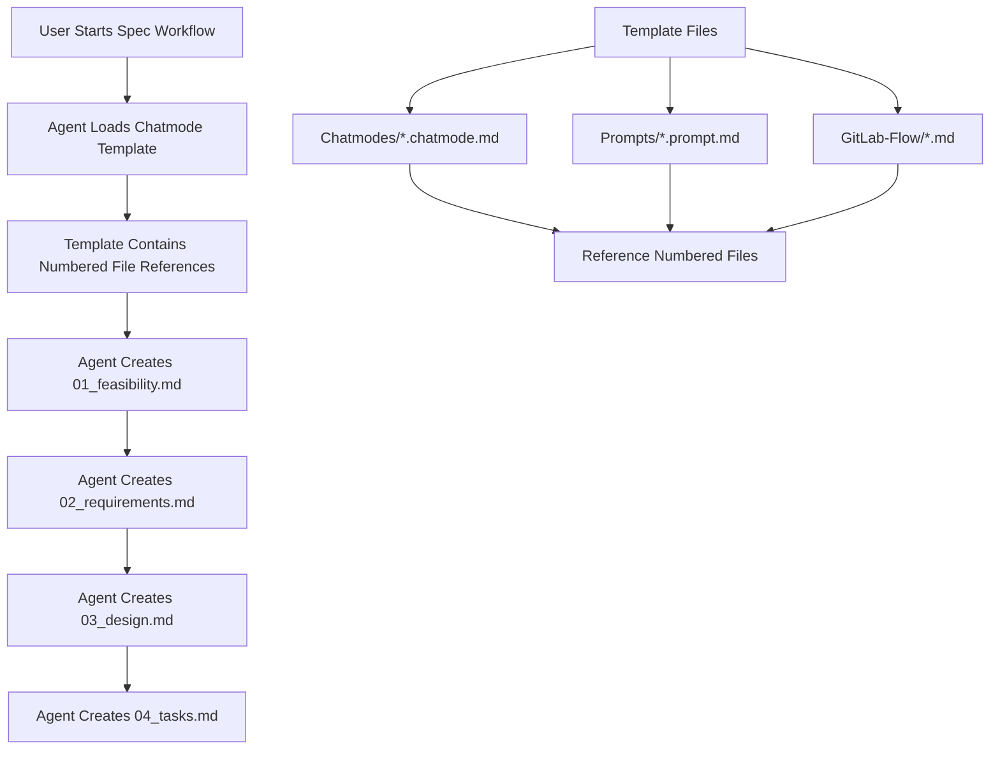

# Design Document: Numbered Spec Files

## Overview

This design implements numbered prefixes for spec files across all SDD templates to create a clear sequential workflow. The solution updates template content without modifying the core CLI functionality, ensuring backward compatibility while improving project organization.

**Current Implementation Status**: NOT IMPLEMENTED - Template infrastructure changes required

## Architecture

The numbered spec files feature operates at the template content level, modifying how chatmode and prompt templates reference spec files. No changes to the CLI core logic are required.



## Components and Interfaces

### Template File Categories

1. **Chatmode Templates** (`templates/chatmodes/`)
   - `sddSpecDriven.chatmode.md`
   - `sddSpecDrivenSimple.chatmode.md`
   - `sddTesting.chatmode.md`

2. **Prompt Templates** (`templates/prompts/`)
   - `sddSpecSync.prompt.md`
   - `sddTaskExecution.prompt.md`
   - `sddTaskVerification.prompt.md`
   - `sddProjectAnalysis.prompt.md`
   - `sddCommitWorkflow.prompt.md`
   - `sddFileVerification.prompt.md`
   - `sddTestAll.prompt.md`

3. **GitLab Flow Templates** (`templates/gitlab-flow/`)
   - `gitlab-flow-workflow.md`
   - `gitlab-flow-pr.md`
   - `gitlab-flow-setup.md`

4. **Instruction Templates** (`templates/instructions/`)
   - `sddPythonCliDev.instructions.md`
   - `sddMcpServerDev.instructions.md`

### File Reference Pattern

**Current Pattern:**
```markdown
Create `.specs/{feature_name}/feasibility.md`
Create `.specs/{feature_name}/requirements.md`
Create `.specs/{feature_name}/design.md`
Create `.specs/{feature_name}/tasks.md`
```

**New Pattern:**
```markdown
Create `.specs/{feature_name}/01_feasibility.md`
Create `.specs/{feature_name}/02_requirements.md`
Create `.specs/{feature_name}/03_design.md`
Create `.specs/{feature_name}/04_tasks.md`
```

## Data Models

### Template Reference Mapping

```typescript
interface FileReference {
  oldName: string;
  newName: string;
  priority: number;
}

const SPEC_FILE_MAPPING: FileReference[] = [
  { oldName: "feasibility.md", newName: "01_feasibility.md", priority: 1 },
  { oldName: "requirements.md", newName: "02_requirements.md", priority: 2 },
  { oldName: "design.md", newName: "03_design.md", priority: 3 },
  { oldName: "tasks.md", newName: "04_tasks.md", priority: 4 }
];
```

### Search and Replace Patterns

```typescript
interface ReplacePattern {
  searchPattern: RegExp;
  replaceWith: string;
  fileTypes: string[];
}

const REPLACEMENT_PATTERNS: ReplacePattern[] = [
  {
    searchPattern: /\.specs\/\{feature_name\}\/feasibility\.md/g,
    replaceWith: ".specs/{feature_name}/01_feasibility.md",
    fileTypes: [".md"]
  },
  {
    searchPattern: /feasibility\.md/g,
    replaceWith: "01_feasibility.md",
    fileTypes: [".md"]
  }
  // ... additional patterns
];
```

## API Contract

No API changes required - this is a template content modification only.

## State Management

No state management changes required. The numbered file names become the new standard for template generation.

## Error Handling

### Template Processing Errors
- **Missing File References**: Continue processing, log warnings for manual review
- **Incomplete Replacements**: Fail fast and report which files need manual attention
- **Pattern Match Failures**: Provide detailed logging of unmatched patterns

### Backward Compatibility Handling
- **Mixed File Names**: CLI continues to work with both old and new naming conventions
- **Legacy Projects**: No forced migration, existing projects remain functional

## Performance Considerations

- **Template Loading**: No performance impact - templates are static files
- **File System Operations**: Numbered files sort naturally, improving directory browsing
- **Search Performance**: Numbered prefixes improve alphabetical sorting in IDEs

## Security Considerations

- **File Path Validation**: Ensure numbered file names follow safe path conventions
- **Template Injection**: No dynamic content generation, static replacements only
- **Access Control**: No changes to existing file permissions or access patterns

## Testing Strategy

### Unit Tests
- Verify all template files contain correct numbered references
- Test regex patterns match expected file name formats
- Validate backward compatibility with existing file names

### Integration Tests
- Test complete spec workflow with numbered files
- Verify chatmode workflows create properly numbered files
- Test GitLab Flow integration with numbered references

### Validation Tests
- Scan all template files for old file name references
- Verify no broken links or missing file references
- Test file sorting behavior in different file explorers

## Rollback Strategy

### Immediate Rollback
1. Revert all template files to previous versions
2. Verify existing functionality restored
3. No CLI or core system changes to rollback

### Gradual Rollback
1. Update specific template categories independently
2. Test each category before proceeding
3. Maintain old references alongside new ones during transition

## Feature Flags

No feature flags required - template changes are applied directly to source files.

## Monitoring & Observability

### Success Metrics
- **Template Consistency**: All templates use numbered references
- **User Adoption**: New specs created with numbered files
- **Error Rate**: Zero broken template references

### Logging Strategy
- Log template file updates during development
- Track spec file creation patterns in user projects
- Monitor for any legacy file name usage

## Missing Components

### Current Gaps
1. **Template Content Analysis**: Need to identify all file name references across templates
2. **Replacement Script**: Automated tool to perform bulk find/replace operations
3. **Validation Tools**: Scripts to verify all references updated correctly
4. **Testing Framework**: Comprehensive test suite for template changes

### Validation Requirements
1. **Reference Completeness**: Ensure every spec file reference uses numbered format
2. **Link Integrity**: Verify no broken internal links between templates
3. **Workflow Continuity**: Confirm chatmode workflows function with new file names

## Future Development Phases

### Phase 1: Core Template Updates (Current)
- Update all chatmode templates
- Update all prompt templates
- Update GitLab Flow templates

### Phase 2: Enhanced Organization
- Add file numbering to other template categories
- Implement numbered sections within spec files
- Create template validation tools

### Phase 3: Migration Assistance
- Optional migration tools for existing projects
- Automated detection of old vs new file naming
- User guidance for mixed naming scenarios

## Implementation Approach

### 1. Analysis Phase
- Scan all template files for spec file references
- Catalog every occurrence of old file names
- Create comprehensive replacement mapping

### 2. Replacement Phase
- Implement systematic find/replace across all templates
- Use regex patterns for accurate replacements
- Validate each replacement for correctness

### 3. Validation Phase
- Test updated templates in real workflows
- Verify backward compatibility maintained
- Confirm no broken references or links

### 4. Documentation Phase
- Update any remaining documentation
- Create migration guidance for users
- Document new file naming conventions

## Cross-Spec Impact Analysis

### Impact Analysis
- **Affects specs**: None (template infrastructure change only)
- **Breaking changes**: None - maintains backward compatibility
- **Migration required**: No - optional for existing projects
- **Dependencies**: Template system, chatmode workflows
- **User experience**: Improved file organization, no disruption

This design provides a comprehensive approach to implementing numbered spec files while maintaining full backward compatibility and ensuring a smooth transition for all users.