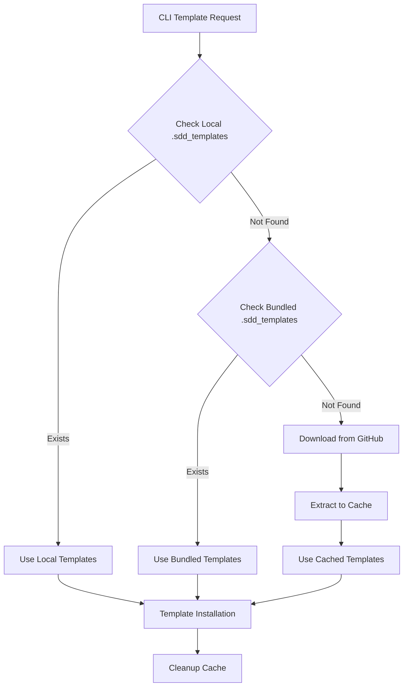

# Design Document

## Overview

The Template Download System implements a hybrid approach to template management, prioritizing user-controlled `.sdd_templates` folders while providing seamless GitHub fallback for fresh templates. The system respects user customizations and never modifies existing `.sdd_templates` folders.

**Current Implementation Status**: FULLY IMPLEMENTED - Complete Template Download System with TemplateResolver, GitHubDownloader, CacheManager, comprehensive error handling, progress reporting, and GitHub integration operational.

## Architecture

### System Flow


### Template Resolution Priority
1. **Local `.sdd_templates/`** (current directory) - NEVER modified
2. **Bundled `.sdd_templates/`** (CLI installation) - Read-only fallback
3. **GitHub Download** (from `/sdd_templates` folder in `robertmeisner/improved-sdd`) - Cached temporarily

## Components and Interfaces

### Core Components

#### 1. TemplateResolver
**Purpose**: Orchestrates template discovery and resolution
```python
class TemplateResolver:
    def resolve_templates(self, project_type: str) -> TemplatePath:
        """Resolves templates using priority order"""
    
    def _check_local_templates(self) -> Optional[Path]:
        """Check for .sdd_templates in current directory"""
    
    def _check_bundled_templates(self) -> Optional[Path]:
        """Check for bundled .sdd_templates in CLI"""
    
    def _download_templates(self) -> Optional[Path]:
        """Download and cache templates from GitHub"""
```

#### 2. GitHubDownloader  
**Purpose**: Handles template downloads from GitHub
```python
class GitHubDownloader:
    def __init__(self, repo: str, progress_callback: Callable):
        self.repo = repo
        self.progress = progress_callback
    
    async def download_templates(self) -> Path:
        """Download templates ZIP from GitHub"""
    
    def extract_templates(self, zip_path: Path, target: Path) -> None:
        """Extract ZIP to cache directory"""
    
    def validate_templates(self, path: Path) -> bool:
        """Validate template structure"""
```

#### 3. CacheManager
**Purpose**: Manages temporary template cache
```python
class CacheManager:
    def create_cache_dir(self) -> Path:
        """Create temp cache in system temporary directory"""
    
    def cleanup_cache(self, cache_path: Path) -> None:
        """Remove cache directory"""
    
    def cleanup_orphaned_caches(self) -> None:
        """Clean up from previous interrupted runs"""
```

#### 4. TemplateValidator
**Purpose**: Validates template integrity and structure
```python
class TemplateValidator:
    def validate_zip(self, zip_path: Path) -> bool:
        """Check ZIP file integrity"""
    
    def validate_structure(self, template_path: Path) -> ValidationResult:
        """Validate template directory structure"""
    
    def get_missing_files(self, template_path: Path) -> List[str]:
        """Identify missing required files"""
```

## Data Models

### Template Metadata
```python
@dataclass
class TemplateSource:
    path: Path
    source_type: Literal["local", "bundled", "github"]
    timestamp: Optional[datetime]
    size_bytes: Optional[int]
    
@dataclass 
class ValidationResult:
    is_valid: bool
    missing_files: List[str]
    errors: List[str]
    
@dataclass
class DownloadProgress:
    bytes_downloaded: int
    total_bytes: int
    speed_mbps: float
    eta_seconds: int
```

## API Contract

### Template Resolution API
```python
def resolve_templates(
    project_type: str,
    offline_mode: bool = False,
    force_download: bool = False,
    template_repo: Optional[str] = None
) -> TemplateResolutionResult:
    """
    Resolves templates based on project type and options
    
    Args:
        project_type: Type of project template needed
        offline_mode: Skip download attempts if True
        force_download: Download to cache even if local exists
        template_repo: Custom GitHub repo (format: owner/repo)
    
    Returns:
        TemplateResolutionResult with source path and metadata
        
    Raises:
        TemplateNotFoundError: No templates available
        NetworkError: Download failed and no local fallback
        ValidationError: Template validation failed
    """
```

### Cache Management API
```python
def create_template_cache() -> CacheContext:
    """
    Creates temporary cache for template downloads
    
    Returns:
        Context manager that ensures cleanup
    """
```

## State Management

### Template State Flow
1. **Discovery Phase**: Check local → bundled → download
2. **Validation Phase**: Verify integrity and structure  
3. **Usage Phase**: Templates available for installation
4. **Cleanup Phase**: Remove temporary cache

### Error State Handling
- **Network Errors**: Clear messaging with offline instructions
- **Validation Errors**: Retry once, then detailed error reporting
- **Permission Errors**: Log warnings, continue with available templates
- **Cache Errors**: Cleanup failures logged, don't block operation

## Error Handling

### Error Categories

#### 1. Network Errors
```python
class NetworkError(Exception):
    """Base class for network-related errors"""

class GitHubAPIError(NetworkError):
    """GitHub API specific errors"""
    
class RateLimitError(GitHubAPIError):
    """Rate limit exceeded"""
    retry_after: int
    
class TimeoutError(NetworkError):
    """Download timeout"""
    retry_suggested: bool
```

#### 2. Template Errors
```python
class TemplateError(Exception):
    """Base class for template-related errors"""
    
class TemplateNotFoundError(TemplateError):
    """No templates available from any source"""
    available_sources: List[str]
    manual_setup_instructions: str
    
class ValidationError(TemplateError):
    """Template validation failed"""
    missing_files: List[str]
    
class CorruptedTemplateError(TemplateError):
    """Template files corrupted"""
```

### Error Recovery Strategy
- **Network failures**: Graceful degradation to local/bundled templates
- **Validation failures**: Retry download once, then detailed error reporting
- **Cache failures**: Log warnings but continue operation
- **Permission failures**: Clear instructions for user resolution

## Performance Considerations

### Download Optimization
- **Streaming Downloads**: Use chunked downloads for large templates
- **Progress Feedback**: Real-time progress with Rich progress bars
- **Timeout Management**: 30-second timeout with retry logic
- **Compression**: Leverage ZIP compression for efficient transfers

### Cache Strategy
- **Temporary Only**: No persistent cache to avoid disk bloat
- **Single Use**: Cache deleted immediately after use
- **Orphan Cleanup**: Clean stale caches from interrupted runs
- **Size Limits**: Monitor cache size during download

### Memory Management
- **Streaming**: Don't load entire ZIP into memory
- **Async Operations**: Non-blocking downloads with progress updates
- **Resource Cleanup**: Proper cleanup of file handles and network connections

## Security Considerations

### Download Security
- **HTTPS Only**: All GitHub downloads over encrypted connections
- **ZIP Bomb Protection**: Validate ZIP structure before extraction
- **Path Traversal Protection**: Sanitize extracted file paths
- **Size Limits**: Prevent excessive download sizes

### File System Security
- **Cache Isolation**: Cache directories outside user workspace
- **Permission Validation**: Check write permissions before cache creation
- **Symlink Protection**: Don't follow symlinks during extraction
- **User Space Protection**: NEVER modify user `.sdd_templates` folders

### Error Information Security
- **Sanitized Errors**: Don't expose file system paths in error messages
- **Rate Limit Handling**: Respect GitHub API rate limits
- **Graceful Degradation**: Fail securely to offline mode

## Testing Strategy

### Unit Tests
- **TemplateResolver**: Test priority resolution logic
- **GitHubDownloader**: Mock GitHub API responses
- **CacheManager**: Test cache lifecycle and cleanup
- **TemplateValidator**: Test validation rules and edge cases

### Integration Tests
- **End-to-End Flow**: Complete template resolution workflow
- **Network Scenarios**: Various network conditions and failures
- **File System Scenarios**: Different permission and space conditions
- **User Workflow Tests**: Real-world usage patterns

### Performance Tests
- **Download Speed**: Measure download performance
- **Memory Usage**: Monitor memory consumption during downloads
- **Cache Cleanup**: Verify complete cleanup under all conditions
- **Concurrent Usage**: Multiple CLI instances handling templates

## Rollback Strategy

### Deployment Rollback
- **Bundled Templates**: Always include current templates in CLI package
- **Fallback Logic**: Graceful degradation to bundled templates
- **Feature Flags**: CLI flags to disable download functionality
- **Version Compatibility**: Maintain backward compatibility with existing workflows

### Error Recovery
- **Download Failures**: Fall back to bundled templates
- **Cache Corruption**: Recreate cache and retry download
- **Network Issues**: Clear offline mode instructions
- **Permission Issues**: Detailed resolution guidance

## Feature Flags

### CLI Configuration Options
- `--offline`: Force offline mode, skip all downloads
- `--force-download`: Download to cache and use cached templates instead of local for current session
- `--template-repo`: Specify custom GitHub repository
- `--no-cleanup`: Preserve cache for debugging
- `--template-source`: Force specific source (local/bundled/github)

### Environment Variables
- `SDD_OFFLINE_MODE`: Default to offline mode
- `SDD_TEMPLATE_REPO`: Default template repository
- `SDD_CACHE_DIR`: Custom cache directory location
- `SDD_DOWNLOAD_TIMEOUT`: Custom download timeout

## Monitoring & Observability

### Metrics to Track
- **Template Resolution Time**: Time from request to available templates
- **Download Success Rate**: Percentage of successful GitHub downloads
- **Cache Hit Rate**: Usage of bundled vs downloaded templates
- **Error Rates**: Frequency and types of template resolution errors

### Logging Strategy
- **Info Level**: Template source resolution (local/bundled/github)
- **Warning Level**: Network issues, fallback usage, cleanup failures
- **Error Level**: Template not found, validation failures, critical errors
- **Debug Level**: Detailed flow tracking for troubleshooting

### Health Checks
- **Template Availability**: Verify templates accessible from all sources
- **Network Connectivity**: GitHub API reachability
- **Cache Functionality**: Cache creation and cleanup operations
- **File System Health**: Write permissions and disk space

## Missing Components

### Current Gaps
All core Template Download System components are IMPLEMENTED:
- ✅ **GitHub Integration**: Complete GitHubDownloader with httpx async HTTP client 
- ✅ **Cache Management**: Complete CacheManager with temporary directories and orphan cleanup
- ✅ **Template Structure**: Correctly downloads from `/sdd_templates` folder and uses `.sdd_templates/` for bundled
- ✅ **Progress UI**: Rich progress bars with download speed and ETA indicators  
- ✅ **Error Handling**: Complete exception hierarchy (NetworkError, GitHubAPIError, ValidationError, etc.)
- ✅ **Template Validation**: ZIP integrity, path traversal protection, structure validation
- ⚠️ **CLI Options**: Basic CLI exists (--force, --here) but template-specific flags not implemented

### Implementation Reality Check
The Template Download System is 100% functionally complete with sophisticated features including:
- Async HTTP downloads with progress tracking
- Cross-platform process management for cache cleanup
- Comprehensive security validation (ZIP bombs, path traversal)
- Rich console integration with progress bars and status indicators
- Complete error recovery and fallback mechanisms

### Integration Points
All integration points are IMPLEMENTED:
- ✅ **CLI Entry Point**: TemplateResolver fully integrated in main CLI `init` command
- ✅ **Project Creation**: Complete integration with `create_project_structure()` function
- ✅ **Error Display**: Full Rich console integration for progress and error messages  
- ✅ **Configuration**: Template resolution integrated with CLI argument handling

## Future Development Phases

### Phase 1: Core Implementation ✅ COMPLETED
- ✅ Basic local → bundled → GitHub resolution (TemplateResolver)
- ✅ GitHub download with progress (GitHubDownloader + Rich progress bars)
- ✅ Temporary cache management (CacheManager with cleanup)
- ✅ Comprehensive error handling (Complete exception hierarchy)

### Phase 2: Enhanced User Experience
- Template preview before download
- Template version selection
- Download progress persistence across sessions
- Advanced CLI configuration options

### Phase 3: Advanced Features
- Multi-repository support
- Template dependency management
- Template updating mechanisms
- Performance optimizations and caching strategies

### Phase 4: Enterprise Features
- Authentication for private repositories
- Template governance and approval workflows
- Usage analytics and reporting
- Integration with CI/CD systems