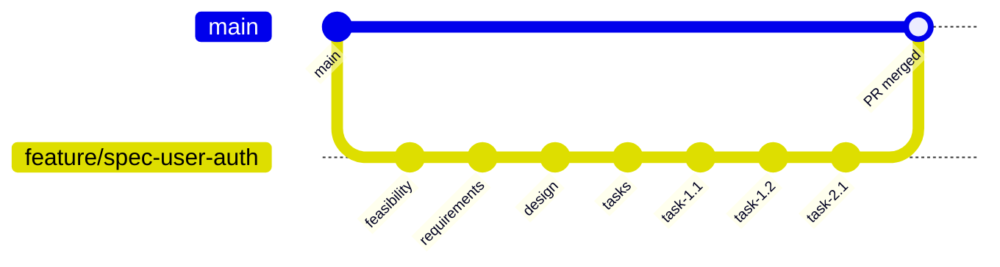

## GitLab Flow Workflow Integration

Systematic version control for specification-driven development with phase-based commits and collaborative review.

### Workflow Diagram



### Branch Naming
```
feature/spec-{kebab-case-name}
```
**Examples:** `feature/spec-user-authentication`, `feature/spec-payment-system`

### Commit Workflow

**1. After each phase approval:**
```bash
{COMMIT}
```

**2. Commit timing:**
- ✅ **Feasibility approved** → Commit 01_feasibility.md
- ✅ **Requirements approved** → Commit 02_requirements.md  
- ✅ **Design approved** → Commit 03_design.md
- ✅ **Tasks approved** → Commit 04_tasks.md
- ✅ **Each task completed** → Commit implementation

### Message Templates

**Spec Phase Example:**
```
feat: Add requirements for user-authentication

- Define user stories and acceptance criteria
- Specify success metrics and security requirements
```

**Task Implementation Example:**
```
feat: Complete Task 1.2 - Add login validation

- Implement email/password validation logic
- Add comprehensive unit tests for edge cases
```

### Best Practices

- **One logical change** per commit (single phase or single task)
- **Complete work** before committing (no partial phases)
- **Descriptive messages** following conventional format
- **Track dependencies** through commit history

**Workflow Benefits:** Feature isolation, incremental safety, team collaboration, easy rollback.